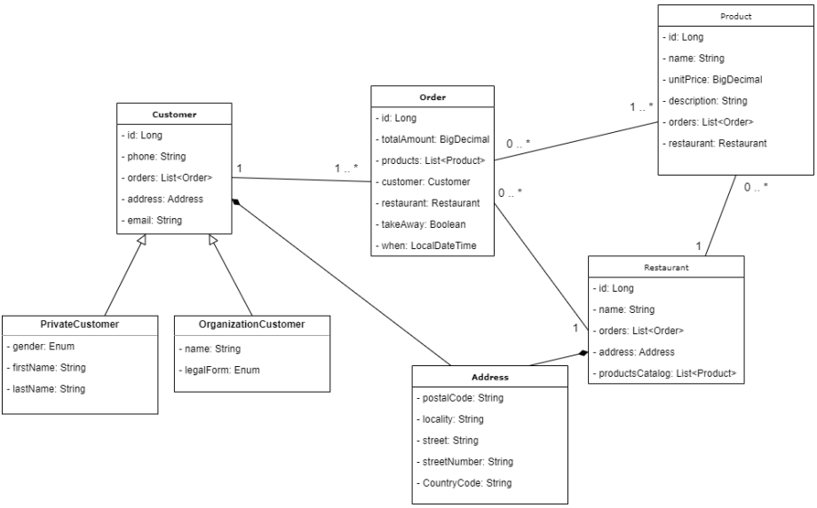
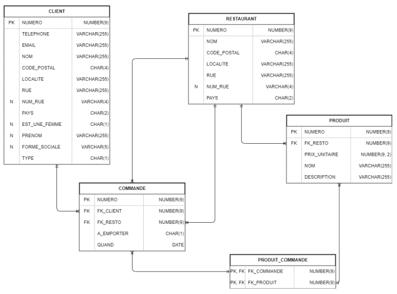

# resto-order

<h2 style="color: red;">Modifications apportées</h2>
⚠️ modification du script de création de tables, ajout d'une contrainte `ON DELETE CASCADE` dans le `ALTER TABLE` de la table `RESTAURANT`

## ✅ Créer le projet
Veuillez télécharger l’application `resto-order` disponible sur Cyberlearn et l’importer dans votre IDE. Lancez le script de création de la structure des données ainsi que le script d’insertion des données sur votre serveur Oracle.

- File -> New -> Project from Existing Sources
- Sélectionnez le fichier `pom.xml` dans le projet
- Confirmez en cliquant sur « OK »
- Note : la version de Java à utiliser est en principe Java 11, mais vous êtes libres d’utiliser des versions plus récentes si vous souhaitez bénéficier de fonctionnalités plus avancées.

## ✅ Présentation du projet

Voici quelques informations supplémentaires sur l'application :

À la racine de l'archive se trouvent deux scripts SQL :
- Le premier permet de **créer la structure** (Tables / Séquences / Triggers).
- Le second permet d'**insérer un jeu de données** de base.

L'autre élément présent dans l'archive est un projet **Maven** que vous pouvez importer dans votre IDE. Ce projet est parfaitement exécutable et a pour but d’accueillir les commandes de clients des restaurants de la région. Il est donc possible de passer commande, ou de consulter les commandes existantes.

Actuellement, le projet ne persiste aucune de ses données. Vous allez devoir implémenter complètement la **couche de persistance**. Cependant, pour que vous puissiez la prendre en main dans un premier temps, le projet de base contient une classe `FakeDb` où sont créées quelques instances d’objets métier par programmation. **Il faudra supprimer cette classe à terme** pour que toutes les données soient récupérées de la base de données.

Le projet Maven contient **quatre packages** :

- **Package `application`** : contient le main de l’application.
- **Package `business`** : contient toutes les classes métier du projet. Le diagramme de classes les présentant se trouve ci-dessous. Les classes sont des POJO classiques : elles contiennent uniquement leurs attributs, quelques constructeurs, et les getters et setters.
- **Package `persistence`** : contient une classe `FakeDb` qui fournit des fausses données à l'application, en attendant la connexion à la base de données.
- **Package `presentation`** : contient des classes qui fournissent une interface en ligne de commande (CLI). Seuls les cas d'utilisation principaux sont implémentés. Il n’est pas possible, par exemple, d’ajouter un restaurant ou un produit.

Cette application a pour but de vous permettre de mettre en pratique rapidement les concepts vus en cours. Certaines simplifications ont été apportées pour éviter des pertes de temps sur certains détails.

---

## ✅ Exercice 1
🛣️ sous : **src/main/java/ch/hearc/ig/orderresto/persistence/mappers/RestaurantMapper.java**

💡 nous avons également implémenté les autres mappers pour les autres classes métiers.

💡 vous trouverez les informations pour lancer le projet dans le fichier [Documentation.md](Documentation.md)

Vous devez persister le modèle de domaine **"restaurants"** dans la structure de données fournie. Utilisez le design pattern **Data Mapper** [Martin Fowler](http://martinfowler.com/eaaCatalog/dataMapper.html) en vous appuyant sur les classes disponibles sur Cyberlearn.

Les méthodes à implémenter incluent :
- **Ajout**
- **Suppression**
- **Mise à jour**
- **Recherche**

---

### Questions à résoudre 

À la fin de cet exercice, vous devrez être capables d’apporter des solutions aux questions suivantes :

### Comment gérer les connexions JDBC ? 
> Les connexions JDBC sont gérées par **ConnectionManager** et la classe **TransactionHandler**
>
> **ConnectionManager :** responsable de charger les propriétés de ocnfiguration de la base de données et de fournir des connexions JDBC 
> 
> **TransactionHandler :** gère les transactions en utilisant un modèle de type try-with-resources pour garantir que les connexions sont correctement fermées, même en cas d'exception
> 
> Tests : les connexions sont gérées manuellement avec des appels explicites

### Comment générer les identifiants techniques (PK) et faire en sorte qu’ils soient présents dans les objets après leur création ? 
> Côté BDD, ils sont générés avec des séquences et des triggers. 
> 
> Dans le projet ces clés sont récupérées avec les méthodes `getGenereatedKeys` (dans les mappers, dans les paramètres du prepare statement par exemple).

### Comment gérer les relations ? 
> Principalement gérés par des classes de **mappers** et des **DTO**.
> 
> **mappers :** elles sont responsable de la conversion des résultats de requêtes SQL en objets Java (et inversement), et gèrenet les relations entre les entités.
> 
> **DTO :** sont utilisés pour transférer les données entre les différentes couches de l'app (par exemple classe Restaurant pour une relation One-to-Many.
>
> tests : les relations sont testées pour s'assurer que les mappers et les DTO fonctionnent correctement ensemble.

### Que faire dans le Data Mapper lors de la recherche du restaurant (rechercher uniquement le restaurant ? également ses commandes ? où s'arrêter ?) ?
> dans ce projet, en fonction des besoins métiers. Si nous voulons uniquement retourner les restaurant, mais si nous voulons retourner également les commandes associées, nous devons également charger les commandes associées.
>
> Par exemple dans ce projet, nous avons une méthode `findWithOrders` qui retourne un restaurant avec ses commandes associées.

### Doit-il y avoir des relations entre les différents Data Mappers ?

> Dans ce projet, oui. Par exemple dans `RestaurantMapper`, on utilise `OrderMapper` pour charger les commandes associées à un restaurant, car dans `OrderMapper`, l'app fournit une méthode pour récupérer les commandes par ID de restaurant.

### Combien d'interactions (requêtes JDBC) sont effectuées avec la base de données dans votre code ?
> Cela dépend de l'opération CRUD. Par exemple, pour ajouter un restaurant, nous devons effectuer une requête JDBC pour insérer le restaurant dans la base de données.
>
> De manière générale chaque opération CRUD implique une requête JDBC.

---
Il n’y a pas toujours de réponses définitives à ces questions, mais des considérations à prendre en compte. Elles peuvent se révéler acceptables ou non selon les cas.

Ne tentez pas de tout gérer en même temps. Commencez simple (par exemple avec la classe `City`) et construisez progressivement.

Cet exercice est important, assez long, et représente les **fondations** pour les futures connaissances de ce cours.

---

## Modèle métier :

## Modèle de données :

# Exercice 2
🛣️ sous : **src/main/java/ch/hearc/ig/orderresto/persistence/IdentityMap.java**

Implémentez la notion d’identity maps dans votre projet.

> L'implémentation de l'identity map est faite dans la classe `IdentityMap` qui est une classe générique qui stocke les objets métier en mémoire. 
> 
> Elle est ensuite implémenté dans la classe `BaseMapper`, qui est également générique, et ensuite la généricité est utilisée pour les autres mappers.

# Exercice 3

🛣️ sous : **src/main/java/ch/hearc/ig/orderresto/service**

Ajoutez une couche de « services » (nouveau package) dans votre application, cette dernière propose des
méthodes « gros grain » et doit être pris en charge de gérer les transactions.
En pratique, il s’agit de déplacer du code présent aujourd’hui dans votre CLI vers une ou plusieurs nouvelles
classes qui s’occupent de :
> - Récupérer une connexion JDBC (ou de créer une nouvelle connexion)
>   - 💡 Utilisez la classe `TransactionHandler` pour gérer les transactions

> - Faire appel à vos différents DataMappers/DAOs
>  - 💡 directement dans les paramètres de la méthode `mapper` 

> - Commiter votre transaction
>  - 💡 nous avons utilisé le `TransactionHandler` pour gérer les commits (et rollbacks) de manière manuelle dans la méthode `executeInTransaction`

>- Optionnel : Fermer (ou libérer) la connection JDBC (ce qui va la rendre au pool de connexions)
>  - 💡 la connexion JDBC est fermée par le `TransactionHandler` grâce au `try-with-resources` dans la méthode `executeInTransaction`.